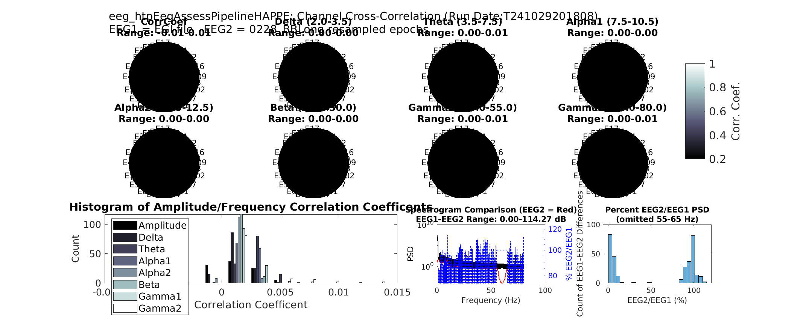

# eeg_htpEegAssessPipelineHAPPE Function

## Overview
The eeg_htpEegAssessPipelineHAPPE function is an adaptation of the [HAPPE](https://github.com/lcnhappe/happe/blob/master/HAPPE_v1.0_README.pdf) (Harvard Automated processing Pipline for EEG) framework. However, it should be stated that this is no tanother preprocessing function, but this function is specifically designed to perform a comparative quality analysis between the intial version of an EEG file and the post process version. (`EEG1` and `EEG2`).  It includes visual quality checks, as well as computation of various quality metrics and statistical outputs. The function returns a summary table of metrics and exports visuals and statistics if specified.

**Please Note** it is necessary to have [**EEGLAB**](https://eeglab.org/) running prior to utilizing the `eeg_htpEegAssessPipelineHAPPE` function.

## Key Features
- Compares EEG datasets `EEG1` and `EEG2` using correlation coefficients across channels and frequency bands.
- Includes signal quality checks, visualizations, and detailed output logs.
- Provides options to adjust resampling rates, define group labels, and export data in different formats.

## Requirements
- The function is designed to use an unprocessed and postprocessed version of the same EEG, not two different EEG samples
- They should also both have the same sampling rate for both files
## Function Syntax
```
[summary_table] = eeg_htpEegAssessPipelineHAPPE(EEG1, EEG2, varargin)
```
## Input Parameters/Requirements

- `EEG1`: The first EEG dataset in EEG `.set` file format and is the initial version of the EEG.
- `EEG2`: The second EEG dataset in EEG `.set` file format and is the post process version of the EEG.
- `varargin`: Optional parameters passed as name-value pairs.

### Optional Parameters (`varargin`)

- `outputdir` (default: `tempdir`): The directory where outputs are saved.
- `resampleRate` (default: 500): Resampling rate for the datasets.
- `groupLabels` (default: {`EEG1.setname`, `EEG2.setname`}): Labels for each group, used in output logs and plots.
- `tableonly` (default: `false`): If `true`, only summary tables are generated without visualization.
- `saveoutput` (default: `true`): If `true`, saves the output files (CSV and image files).
- `outputfile` (default: `[]`): Specifies a custom filename for the CSV output file.


## Steps and Details
### 1. Input Validation and Resampling
- The function validates the data type for inputs and confirms that the sampling rates of `EEG1` and `EEG2` are the same.
- If resampling is needed (defined by `resampleRate`), it uses the function `eeg_htpEegResampleDataEeglab` to resample both EEG datasets to the specified rate.
### 2. Signal Preparation
- Converts epoch data into continuous format if `EEG1` or `EEG2` are epoched.
- Converts EEG data to `double` precision to ensure accuracy during calculations.
### 3. Quality Assurance Metrics
The function obtains several quality assurance metrics:

- Channel Correlation Coefficient: 
    - Description: This measures the linear relationship between the corresponding channels of `EEG1` and `EEG2`.
    - Calculation: The correlation coefficient is calculated for each channel across the two datasets using the `corr` function.
    - Output: A vector of correlation coefficients, one for each channel. High values close to 1 indicate high similarity between the channels.
- Frequency Band Correlation: 
    - Description: This assesses the similarity of EEG signals in specific frequency bands across channels.
    - Calculation: The magnitude-squared coherence (`mscohere`) function is used to compute the coherence between signals for each frequency band.
    - Output: A matrix where each row corresponds to a channel and each column to a frequency bin. Higher coherence values indicate stronger similarity in the frequency domain.
- Signal-to-Noise Ratios (SNR): 
    - Description: This measures the ratio of signal power to noise power in the EEG data.
    - Calculation: The SNR is calculated using a forumla that divides the square root of two variable `NUM` and `DEN`. Then converts its units into decibels using a lograithmic funcition. `NUM` is the sum of squares of the EEG signal, and `DEN` is the sum of squared differences between EEG1 and EEG2.
    - Output: A single SNR value indicating the overall signal quality relative to noise.
##Outputs 
###Primary Outputs
The function generates and exports:
- `summary_table`: A table containing quality metrics, correlations, and information about channels with lower quality signals.

- `qi_table` (optional): A quality index table for tracking assessment details across multiple EEG datasets.

- CSV File: If `saveoutput` is `true`, the function saves the `summary_table` in CSV format. A custom filename can be specified with `outputfile`.

- Image File: Saves visualizations as a PNG image if `tableonly` is `false`.

### Optional Visualization 
(**Note** - Only will occur if `tableonly` is `false`)

- Topographic Plots:  These plots show the correlation coefficients for different EEG channels. The units are dimensionless because correlation coefficients range from -1 to 1.
- Histogram: The x-axis represents the correlation coefficient values (dimensionless), and the y-axis represents the count or frequency of these values.
- Spectrogram and Difference Line Plot: Compares the power spectral density (PSD) of `EEG1` and `EEG2` with a line plot highlighting percentage differences. The y-axis (left side) represents the Power Spectral Density (PSD) in logarithmic units, typically dB/Hz (decibels per Hertz). The y-axis (right side) represents the percentage difference in power between EEG2 and EEG1, expressed in percentage (%).

- Difference Histogram: Plots The x-axis represents the percentage difference between EEG2 and EEG1 power (%), and the y-axis represents the count or frequency of these percentage differences.

# 


### Example Usage
```
% Load EEG datasets
EEG1 = pop_loadset('filename', 'EEG1.set', 'filepath', 'path/to/data');
EEG2 = pop_loadset('filename', 'EEG2.set', 'filepath', 'path/to/data');

% Run quality assessment with custom parameters
summary_table = eeg_htpEegAssessPipelineHAPPE(EEG1, EEG2, ...
    'outputdir', 'example_directory', ...
    'resampleRate', 250, ...
    'groupLabels', {'Control', 'Experimental'}, ...
    'tableonly', false, ...
    'saveoutput', true, ...
    'outputfile', 'EEG_quality_comparison.csv');
```
# Final Notes
Ensure EEG datasets `EEG1` and `EEG2` have similar structure (ie. same sampling rate and sample size) and channels before running.
Use `resampleRate` to control the down-sampling for faster processing if EEG data has a high sampling rate.
This function requires access to EEGLAB functions such as `pop_loadset` and `eeg_htpEegResampleDataEeglab`, so make sure they are in your working directory.